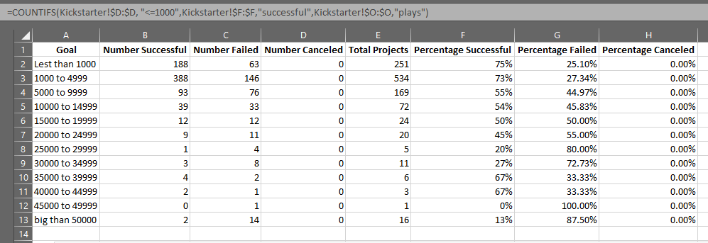
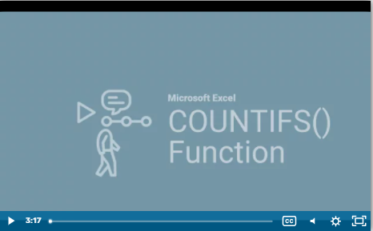
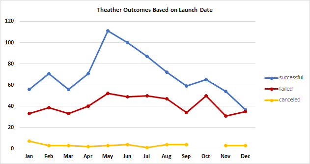
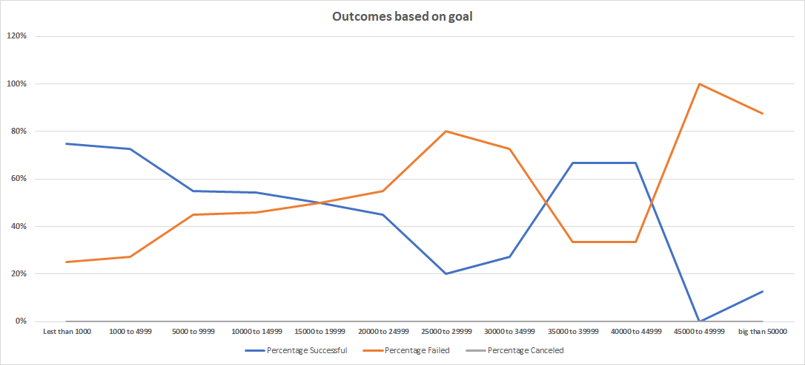

# Kickstarting with Excel

## Overview of Project
### This analysis provides information about how different campaigns fared in relation to their launch dates and their funding goals related to Louise’s play Fever, using data base information we will sharing results based on goals also represented on analytics graphs.

## Analysis and Challenges
### Main challenges encountered are related to use of “COUNTIFS” function because I’ve never used before, the understanding of how the criteria is between quantities and strings like “>1000” looks hard to figured out to me:

### So, after watch the help video I had the knowledge and set my formulas as well. I’m really convinced that documentation help is too interesting and great help to develop the analysis. 

### Analysis of Outcomes Based on Launch Date
#### The following graph shows the behaivor for successful, failed and canceled programs by month, we aslo can provide extra filter that can give us the results by year

### Analysis of Outcomes Based on Goals
#### The following graph shows outcomes trend based on goals, also we can identify a successful positive trend in the different goals ranges

## Results

### What are two conclusions you can draw about the Theater Outcomes by Launch Date?
#### 1.	Second quarter is the best time to launch program, represent the highest successful   
#### 2.	For successful outcomes we can see incremental trends after March and decremental trends after May

### What can you conclude about the Outcomes based on Goals?
####  •	While goals are biggest the failed percentage increment
####  •	The smallest goals trend to achieve successful results 
####  •	No plays programs were canceled

### What are some limitations of this dataset?
#### •	Data type format source should be changed to use in measurements
#### •	Some columns are not relevant for required analysis
### What are some other possible tables and/or graphs that we could create?

#### •	What countries represent the most monetary input 
#### •	What programs need more spotlights 
#### •	What programs need more focus high goal quantity or small goal quantity, based on successful outcomes

#### For extra analysis reference please see the attached file [Kickstater Challenge](https://github.com/JulioAQuintana/kickstarter-analysis/blob/main/Kickstarter_Challenge.zip)
